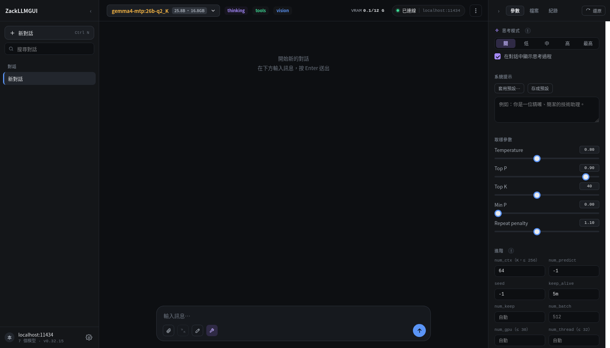
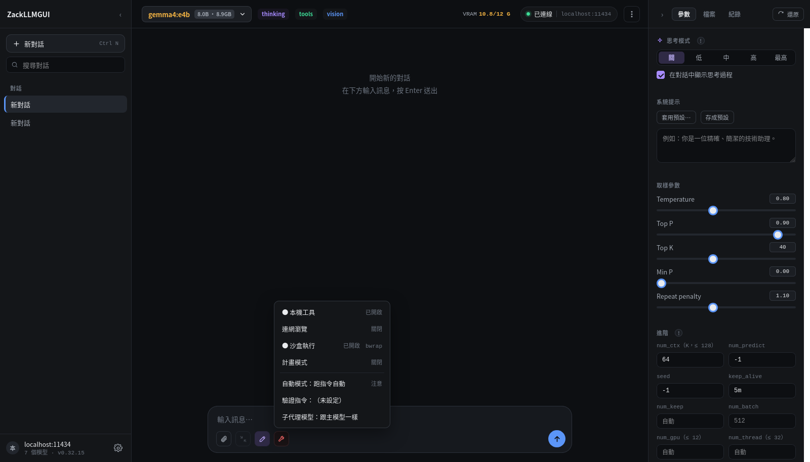
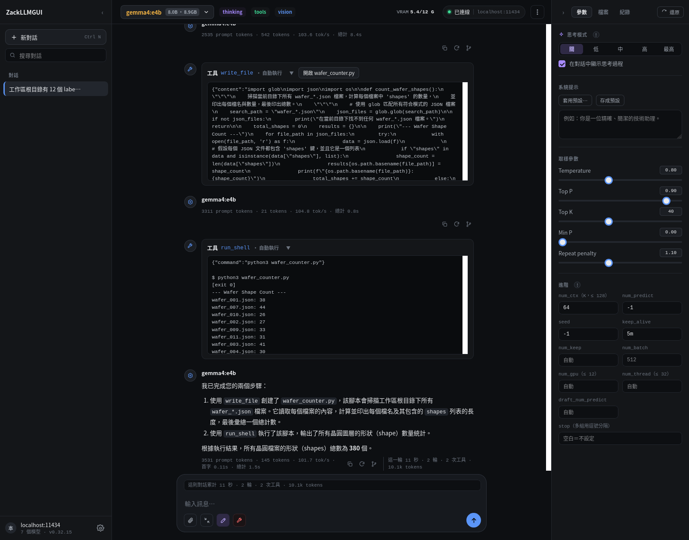
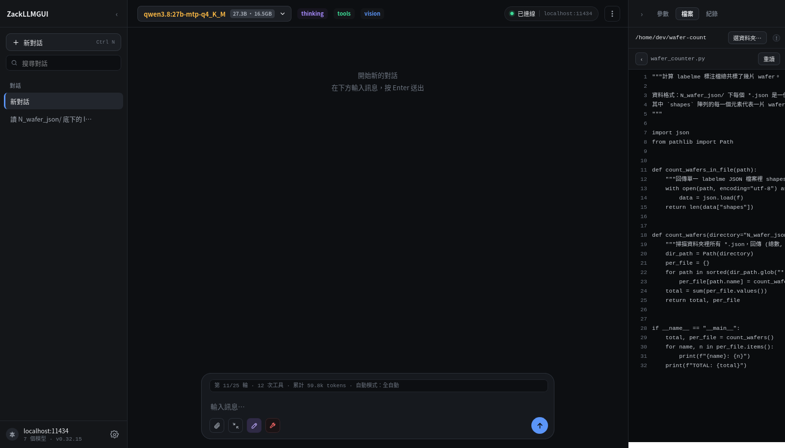

# ZackLLMGUI

Ollama 的網頁前端，**單一 HTML 檔** —— 不需要建置、不需要 Node.js、不吃任何 CDN。

它不只是聊天介面：接上工作區之後，模型會自己讀檔、寫檔、建環境、跑測試，
全程在你自己的機器上，可以關進沙盒，每一次改檔案都留得住還原點。



## 30 秒開始

```bash
python serve.py --ollama http://192.168.1.20:11434
```

Python 3.8+，**只用標準函式庫**，不用 `pip install` 任何東西。瀏覽器會自己打開。

想直接按兩下 `zackllmgui.html` 也可以，只是 Ollama 那台要設 `OLLAMA_ORIGINS`，
而且解析 PDF / Word 與本機工具用不了。兩種方式的差別見[使用手冊](manual.md#兩種開啟方式)。

## 功能一覽

| | |
|---|---|
| **思考模式** | 控制項依模型能力自動變形：gpt-oss 給四段、qwen3 給開關、沒有的整組停用並**完全不送 `think` 欄位** |
| **本機工具** | 讀檔、寫檔、列目錄、搜尋、`run_shell`、`run_tests`、`setup_env`、git、連網瀏覽 |
| **長指令丟背景** | `npm install`、`cargo build` 這種跑幾分鐘的加 `background`，模型先去做別的再回來收；**關掉分頁它還在跑** |
| **沙盒** | Linux 用 bubblewrap、macOS 用 sandbox-exec、Windows 用容器。**預設關**，按鈕開。**顯示卡會自動接進去** |
| **權限規則** | 確認卡上的「以後都放行」把這次的判斷寫成一條規則，不用每天重新點。allow / ask / deny 寫成檔案，專案與全域兩份都讀，`deny` 由 `serve.py` 強制 |
| **專案地圖** | 開工作區時就算好「有哪些檔案、每個檔案裡有什麼」放進系統提示。模型不必再花三五輪 `list_dir`／`search_files` 猜檔名 —— 而**每一輪的成本是重吃一次整份 context** |
| **改完自動檢查** | 模型寫完 `.py`／`.js` 自動跑 linter，錯誤直接回灌給它。不用設定、沒有開關 |
| **收工前攔一次** | 寫了測試卻沒跑過就說「做完了」？推回去讓它跑完再收工 |
| **收尾要驗過才算** | 設一條驗證指令（`pytest`、`npm test`…），模型說做完時**自動跑一次**，沒過就把輸出丟回去讓它接著修。兩次沒過交還給你 |
| **子代理可以用別的模型** | 選單裡選一個「子代理模型」，或在 `agents/*.md` 裡指定。只 load 得動一個模型的機器維持預設（跟主模型一樣）就好 |
| **中斷可以續跑** | 按停止之後一鍵接著跑，從斷掉的字接下去，不是重講一遍 |
| **跑到一半可以插話** | 打字按 Enter 排進佇列，不中斷正在跑的工具，下一輪跟工具結果一起送過去 |
| **看得出它在幹嘛** | 進度條顯示已跑多久（秒數自己走）、背景有幾條在跑、「現在：<第一個未完成的待辦>」；一輪跑完在對話裡留下總計 |
| **放著跑就跑到完** | 本機模型沒有時間與用量上限；只有 200 輪的失控煞車，撞到也是留一顆「繼續」。外部 API 按量計費，所以那邊有 token 上限 |
| **模型知道還剩幾輪** | 剩五輪以內開始提醒，剩兩輪叫它收尾 —— 不然它會把時間花在探索，最後停在一半 |
| **改待辦不用打斷它** | 待辦清單同時是工作區裡的一份 markdown，跑的時候直接編輯，下一輪就同步進去 |
| **`檔案:行號` 可點** | 模型寫的 `wafer_counter.py:42` 點一下就跳到檔案分頁那一行並亮起來 |
| **待辦有相依** | 可以標「要等 #2」，卡住的與可以做的分開算，不會看起來像五件事都沒動 |
| **連不上會重試** | 三次退避重試並倒數，連不上時送出鍵也不再是灰的 |
| **改了就自己重開** | 動過 `serve.py` 的程式碼，它會自己重啟、網頁跟著重整 —— 不會出現「改好了卻沒生效」 |
| **每個分頁各做各的** | 工作區、修改權限、自動模式、待辦、計畫、MCP 連線都**跟著分頁走** —— 兩個分頁開兩個專案不會互相蓋掉 |
| **重開接回設定** | 那些狀態住在 `serve.py` 的行程裡，重啟就沒了；開頁面時自動接回來並告訴你接了哪幾項 |
| **側欄可拖寬** | 左右兩側都能拖，雙擊還原，寬度記住 |
| **還原點** | 改檔案**與刪檔案**前自動備份（刪檔走 `delete_file`，不是 `rm`），紀錄分頁只顯示這輪對話的還原點，一鍵倒回去 |
| **子代理** | 把一段查找丟給另一個 context 去做，只把結論帶回來。型別是 `agents/*.md` 裡的檔案，加一種不必改程式；**工具清單由 `serve.py` 強制**，唯讀的就是唯讀的。會改檔案的跑在自己的 git worktree 裡（`.venv` 用讀的借、`node_modules` 用連的借，不必重建環境），所以可以平行跑 |
| **子代理停得住、收得回來** | 每張卡片一顆「中斷」，或打 `/agents` 挑一個，連**後代與背景指令**一起停。改完自動 commit 到自己的分支，回報時附上 `git diff --stat` 與一句可以直接貼的 `git merge`；`serve.py` 重啟過也不會留下「沒人認得的資料夾」 |
| **對話存 IndexedDB** | 不再卡在 `localStorage` 的 5MB；一則對話一筆，只寫改動的那一則。**資料不出這台瀏覽器**，伺服器只出算力 |
| **skills** | 對話框打 `/` 叫出，也可以讓模型自己判斷要不要載入。正文寫 `` !`git status` `` 就能帶著現場狀態載入；用不到的（工作區唯讀而它要改檔案）不會列給模型看 |
| **`@` 提檔案** | 打 `@` 列出工作區檔案或資料夾；選資料夾會一次附整包（有上限，超過會講清楚少了幾個） |
| **context 管理** | 用量條、到 80% 先瘦身工具輸出、壓縮後告訴你省了幾 K；過 75% 在背景先把摘要算好，**放著跑到 85% 就自己壓** —— context 滿了不會報錯，是默默把最前面的訊息丟掉 |
| **附加檔案** | 純文字、程式碼、PDF、Word、圖片（vision 模型）；貼上大段文字自動收成附件 |
| **多模型比較** | 同一個問題同時送給多個模型，並排看 |
| **模型管理** | 拉取、刪除、看 Modelfile，帶進度條 |
| **外部 API** | 同一個介面也能接 OpenAI 相容端點，工具也能用（勾「送出工具定義」） |

## 它會動你的檔案，所以邊界寫在這



**上面每一個開關都在網頁裡按，不用重開 `serve.py`，也不用去改設定檔。**
`python serve.py` 起來之後，工具、連網、沙盒、自動模式、允許規則
全部在這個選單裡調 —— 指令列的旗標只是「開機就是這個狀態」的預設值。

四道關卡，由外而內：

1. **子代理的工具清單**決定「這一個子代理能叫哪幾支」—— 寫在 `agents/*.md`，
   由 `serve.py` 的 `agent_guard()` 強制。`explore` 就算吐出 `write_file` 這個字串
   （模型幻覺、提示詞注入）也會被拒絕。網頁那端的過濾只是「不給它看到」，不算關卡。
   （只對子代理生效；主代理沒有這一層。）
2. **自動模式**決定「要不要問你」——五檔，每一檔的名字就是它多放行的東西：
   每次都問／唯讀自動／**改檔案自動**／跑指令自動／工作區內全自動。
   平常待在「改檔案自動」：改檔案有還原點，跑指令沒有。
   最後那一檔連 `rm`、`mv`、`chmod` 也不問，**但只限路徑全都在工作區裡的**
   （`serve.py` 的 `ws_scoped()` 判，動到工作區外、`sudo`、裝套件照樣問）——
   放著讓它自己跑測試用的。**沙盒開著時它會放行全部 ⚠ 級指令**，因為那時候
   「動不動得到工作區外」不必再從指令去猜。它管的是問不問，**不是能不能做**。
3. **權限規則**的 `deny` 決定「能不能做」—— 在 `serve.py` 裡強制，網頁怎麼點都繞不過。
4. **沙盒**決定「做了會影響到哪」—— 工作區以外唯讀、憑證目錄蓋掉、斷網。

改檔案前一律備份到 `<工作區>/.zackllmgui-backup/`，`run_shell` 的高風險指令直接擋下來。
另外，**只有這支服務自己開出來的那一頁叫得動它、也才讀得到它** —— 你開著它的時候
逛到的別的網頁不行（`same_site()`；沒有這一道的話，一張跨站的表單就能跳過上面每一格，
而網域指回 127.0.0.1 的那種把戲連 GET 都繞得過去）。
**擋得住什麼、擋不住什麼**寫在 [safety/README.md](safety/README.md)，別跳過那份。

順帶一提：**沙盒裡裝得動套件，也吃得到 GPU**（實測 `torch.cuda.is_available()` 在裡面是 `True`）。
bwrap 是 namespace 層的隔離，不換掉檔案系統，宿主機的 pytest、gcc、node、CUDA 驅動本來就在那裡，
沒有「映像檔裡沒裝」這回事。細節見 [sandbox/README.md](sandbox/README.md)。

### 改完就自動檢查

模型寫完 `.py` 或 `.js`，馬上跑一次 linter，錯誤**接在工具結果後面**回灌給它 ——
下一輪它自己就修掉了，不用等你發現。

```
已寫入 wafer_counter.py（412 字元）

[ruff] 這是剛剛寫入的檔案的檢查結果，請修掉：
wafer_counter.py:3:8: F401 [*] `os` imported but unused
```

**沒有設定檔，也沒有開關。** 裝了 `ruff` 就用 ruff、`eslint` 就用 eslint，
兩個都沒有的話 `.py` 還是會用標準函式庫的 `ast` 檢查語法 —— 模型最常寫壞的就是那個。
什麼都沒裝就安靜跳過，不會變成噪音。

> 只跑**唯讀**的檢查，不跑 `black`／`prettier` 這種會改檔案的。
> 在模型背後改掉檔案，它手上的內容就過期了，下一次 `edit_file` 的比對會對不上。
> 這是 aider 的 `--auto-lint`（預設開）那一套 ——
> 不是那些要你自己寫一份 hooks 設定檔的做法。

## 一個實際跑過的例子

上面那些湊起來實際長什麼樣。工作區裡只有一批標注資料：12 個 labelme 標注檔。沒有程式、沒有 README、沒有任何說明。
**跑指令自動 + 沙盒開啟**，丟一句話進去：

> 讀 `N_wafer_json/` 底下的 labelme 標注檔（每個 shapes 元素是一片 wafer），算出這批資料
> 總共標了幾片。寫成 `wafer_counter.py`，附上 pytest 測試，最後跑一次測試確認會過。

然後就沒有再按過任何確認：



**11 輪、12 次工具呼叫。** 它做的事情按順序是：

| 工具 | 做了什麼 |
|---|---|
| `load_skill` | **自己決定**要載入 `run-pytest` 這份技能，沒有人叫它載 |
| `list_dir` | 先看資料夾裡有什麼 |
| `run_shell` ×2 | **開一個 JSON 出來看格式**，再掃過全部確認，沒有用猜的 |
| `write_file` | 寫 `wafer_counter.py` |
| `write_file`／`edit_file` ×2 | 寫 `test_wafer_counter.py`，再自己改兩版 |
| `setup_env` | 在沙盒裡建 `.venv`、`pip install pytest` |
| `run_tests` | `5 passed in 0.01s` |
| `run_shell` | 真的跑一次程式，答案是 **380 片** |

從第一個檔案落地（10:11:52）到測試變綠（10:14:24），**2 分 32 秒**。

值得看的是**它沒有猜資料格式**：先用 `run_shell` 開一個檔案出來確認 `shapes` 長什麼樣，
才動手寫程式。測試也是它自己想的五個案例，其中一個是拿真實的那 12 個檔案做整合檢查 ——
不是只測會過的路徑。

> 這個任務先前用另一個模型跑過一次，答案一樣是 380。
> 那一輪的完整痕跡比對（怎麼從硬碟上反推它確實在沙盒裡跑完）在[使用手冊](manual.md#一個實際跑過的例子)。

產出的檔案就在右邊的**檔案**分頁裡，點一下直接看：



> 這個例子錄的是**單一代理**跑完一件事。後來加的子代理、worktree、自動壓縮不在裡面 ——
> 那些在上面的功能一覽。裡面每一支工具現在跑起來都還是一樣。

> **venv 還是沙盒？兩個都是。** 沙盒是箱子，venv 是箱子裡的環境：
> `setup_env` 在沙盒裡建 `.venv`，`run_tests` 再用那個 `.venv` 的 python 跑，全程沒有離開箱子。

## 文件

| 文件 | 回答什麼問題 |
|---|---|
| **README.md**（這份） | 這是什麼、能做到什麼 |
| [manual.md](manual.md#功能) | 每個功能怎麼用、快捷鍵、資料存在哪、專案結構。功能分成八組，段首有目錄 |
| [tech.md](tech.md) | **為什麼**這樣做 —— 看程式碼之前先看這份。分七組，開頭有「這份文件怎麼讀」 |
| [safety/README.md](safety/README.md) | 安全邊界：擋得住什麼、擋不住什麼 |
| [sandbox/README.md](sandbox/README.md) | 各平台的沙盒支援到什麼程度，以及 GPU 哪些驗過哪些沒有 |
| [skills/README.md](skills/README.md) | 內建 skills，以及怎麼寫自己的 |
| [plan-agent.md](plan-agent.md) | 還沒做的，與為什麼是這個順序 |

**「這裡為什麼不能做某件事」有三個答案，分別在三個地方** —— 它們的下一步不一樣，
所以刻意不寫在一起：

| 問題 | 去哪找 |
|---|---|
| 知道有更完整的做法，但目前這樣就夠 | tech.md〈刻意的簡化（ponytail 紀錄）〉，每條都寫了天花板與升級路徑 |
| 做不到或不打算做 | tech.md〈已知限制〉 |
| 還沒做，但可能要做 | [plan-agent.md](plan-agent.md) 第 2 節（做完就從那裡刪掉，所以那份永遠只有待辦） |

## 還沒做的

下一輪要動的是**體感**那三項 —— 不是做不到，是同一件事要多按幾下：

| | 現在 | 想要 |
|---|---|---|
| 切換自動模式 | 扳手 → 自動模式 → 選一項 | `Shift+Tab` 循環，輸入框旁邊一直看得到在哪一檔 |
| 中斷 | 滑鼠移到右下角點停止 | `Esc` 就停 |
| 還原 | 只倒得回檔案 | 連對話一起倒回去 |

能力上還缺的兩項都卡在「值不值得」而不是「怎麼做」：
**子代理的改動要人自己下最後那句 `git merge`**（自動合撞到衝突會把工作區弄成
一半合完的狀態，比自己 merge 更難收拾），以及**子代理是同步的**
（要「跑完再通知」得把整個工具迴圈從瀏覽器搬進 `serve.py`）。

**向量檢索（RAG）** 也還沒有 —— 附加檔案是整份塞進 context，沒有切塊也沒有向量庫。
它卡在一個還不存在的答案：找程式碼時 `search_files`（grep）幾乎都贏過向量檢索，
RAG 真正的價值在**文件**，所以要先知道使用者到底都丟什麼進來。
（「模型找不到東西」那一半已經不歸它管了 —— 專案地圖把那件事變成了固定成本。）

每一項的成本、做完長什麼樣、卡在哪，見 [plan-agent.md](plan-agent.md)。

## 不做的

**圖片生成** —— Ollama 的 API 沒有影像輸出，`vision` 指的是「看得懂圖片」不是「畫得出圖片」。
**VS Code 擴充套件** —— 那是另一個專案（TypeScript、擴充 API、打包發佈），
跟這份單一 HTML 檔的設計完全相反。
**語意索引取代 `search_files`** —— 找函式名要的是精確比對。
其餘的（LSP、跨對話 memory 工具、MCP 的 HTTP 傳輸）與理由見
[plan-agent.md](plan-agent.md) 第 5 節。

## 自我檢查

```bash
python tests/test_serve.py    # 後端 97 項
python tests/test_core.py     # core/ 各模組的介面 6 項
node   tests/test_gui.js      # 網頁 69 項
```

兩份都不需要安裝任何東西，也不需要 Ollama 在跑。

另外兩支是不同用途，不在這條線上：`tests/test_skills.py` 驗 `skills/` 的格式，
`tests/test_agent.py` 需要 Ollama —— 它讓真的模型修好一個壞掉的專案，
也是拿來**量**東西的（`--no-rules` 量系統提示值多少、`--tools=a,b` 量工具定義值多少）。
